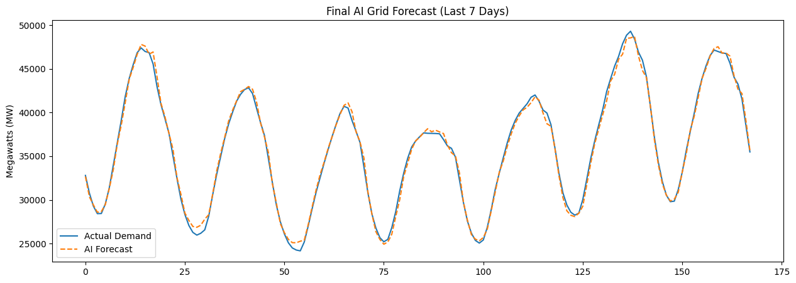

# ⚡ PJM Electricity Grid Forecasting
### Deep Learning for Real-Time Energy Demand Prediction using LSTM
<div align="center">


</div>

This project implements a **Time-Series Forecasting** model using a **Long Short-Term Memory (LSTM)** neural network to predict hourly electricity consumption for the PJM East regional grid. It includes a custom "Stress Test" feature to simulate grid stability during extreme weather events.

---

## 🧠 The Concept: Time-Series Forecasting
Unlike standard machine learning (like predicting a house price based on square footage), **Time-Series Forecasting** predicts the future by looking exclusively at the patterns of the past. 

In this project, we use a **Sliding Window** approach:
* **Input (X):** The electricity demand (MW) of the previous 24 hours.
* **Target (y):** The electricity demand (MW) of the 25th hour.

By sliding this window across years of data, the AI learns the "pulse" of the grid—recognizing daily spikes, nightly drops, and seasonal trends.

---

## 🧬 The Algorithm: Why LSTM?
Standard Neural Networks have "amnesia"—they treat every hour as an independent event. For energy grids, this doesn't work because 4:00 PM is heavily influenced by what happened at 3:00 PM.

We use **LSTM (Long Short-Term Memory)** because:
1.  **Memory Cells:** LSTMs have an internal "conveyor belt" that carries important information from the beginning of the sequence to the end.
2.  **Pattern Recognition:** They are experts at spotting daily cycles (day vs. night) and weekly cycles.
3.  **Sequential Logic:** They process data in order, making them the gold standard for time-based data.

---

## 🛠️ How the Code Works

### 1. Data Preprocessing
* **Scaling:** We use `MinMaxScaler` to squish Megawatt values into a range between 0 and 1. This prevents the mathematical gradients in the neural network from "exploding."
* **Sequencing:** The `create_sequences` function transforms a flat list of numbers into a supervised learning dataset of "Flashcards" (24 hours input -> 1 hour output).

### 2. The Model Architecture
* **Layer 1:** LSTM with 64 units (to capture broad trends).
* **Dropout:** A 20% dropout rate to prevent **Overfitting** (ensuring the AI learns general patterns rather than memorizing the training data).
* **Layer 2:** LSTM with 32 units (for finer detail).
* **Output:** A Dense layer that outputs 1 single number: the predicted Megawatts.

### 3. Scenario Stress Testing (The "What-If" Engine)
The code includes a unique function to test grid reliability. By applying a **multiplier** to real-time data, we simulate:
* **Heatwaves (+20%):** Can the grid handle a massive spike in Air Conditioning use?
* **Energy Savings (-15%):** How does the grid react to a successful conservation campaign?

---

## 🚀 Getting Started

### Prerequisites
You will need Python 3.x and the following libraries installed:
```bash
pip install pandas numpy matplotlib scikit-learn tensorflow kagglehub
```

### Running the Project
1. Clone this repository.
2. Run the main script:
   ```bash
   python energy_forecast.py
   ```
3. The script will download the dataset, train the model, run the stress tests, and display a forecast graph for the last 7 days.

---

## 📊 Results & Visualization
The model produces a visual forecast comparing **Actual Demand** vs. **AI Forecast**. 


---

## 📁 Project Structure
* `energy_forecast.py`: The main Python logic and model training.
* `requirements.txt`: List of dependencies.
* `.gitignore`: Prevents temporary cache files from being uploaded.
* `README.md`: This documentation.

---

**Developed by:** Chitrabhanu Hazra
**Focus:** Deep Learning | Time Series Analysis | Energy Infrastructure
